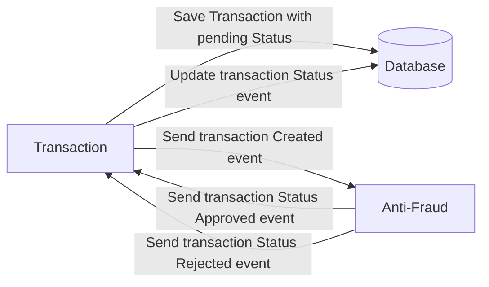

# Solution

The proposed solution is the development of 2 microservices: one for handling transactions (creation and update of status) and the other to validate the transaction.

Both microservices use hexagonal architecture to divide the microservice structure into layers to allow for scalability, flexibility and smooth code maintenance, and are developed using solid principles and design patterns

The transactions-ms contain unit-test to 100% coverage.

#### Design patterns and SOLID principles used in the solution:
- Dependency inversion: We use interfaces for repositories and services.
- Single Responsibility: Each class has a single responsibility.
- Repository Pattern: To manage the persistence of entities.
- Use Case Pattern: Encapsulates the business rules and separates the logic from the infrastructure.
- Strategy Pattern: It allows us to add strategies without touching the main code.

#### How to run services
- docker compose up -d
- cd /transactions-ms and npm run start:dev
- cd /antifraud-ms and npm run start:dev

Postgre will automatically pull up the DB transactions since it was added to the docker compose.


# Yape Code Challenge :rocket:

Our code challenge will let you marvel us with your Jedi coding skills :smile:. 

Don't forget that the proper way to submit your work is to fork the repo and create a PR :wink: ... have fun !!

- [Problem](#problem)
- [Tech Stack](#tech_stack)
- [Send us your challenge](#send_us_your_challenge)

# Problem

Every time a financial transaction is created it must be validated by our anti-fraud microservice and then the same service sends a message back to update the transaction status.
For now, we have only three transaction statuses:

<ol>
  <li>pending</li>
  <li>approved</li>
  <li>rejected</li>  
</ol>

Every transaction with a value greater than 1000 should be rejected.



# Tech Stack

<ol>
  <li>Node. You can use any framework you want (i.e. Nestjs with an ORM like TypeOrm or Prisma) </li>
  <li>Any database</li>
  <li>Kafka</li>    
</ol>

We do provide a `Dockerfile` to help you get started with a dev environment.

You must have two resources:

1. Resource to create a transaction that must containt:

```json
{
  "accountExternalIdDebit": "Guid",
  "accountExternalIdCredit": "Guid",
  "tranferTypeId": 1,
  "value": 120
}
```

2. Resource to retrieve a transaction

```json
{
  "transactionExternalId": "Guid",
  "transactionType": {
    "name": ""
  },
  "transactionStatus": {
    "name": ""
  },
  "value": 120,
  "createdAt": "Date"
}
```

## Optional

You can use any approach to store transaction data but you should consider that we may deal with high volume scenarios where we have a huge amount of writes and reads for the same data at the same time. How would you tackle this requirement?

You can use Graphql;

# Send us your challenge

When you finish your challenge, after forking a repository, you **must** open a pull request to our repository. There are no limitations to the implementation, you can follow the programming paradigm, modularization, and style that you feel is the most appropriate solution.

If you have any questions, please let us know.
